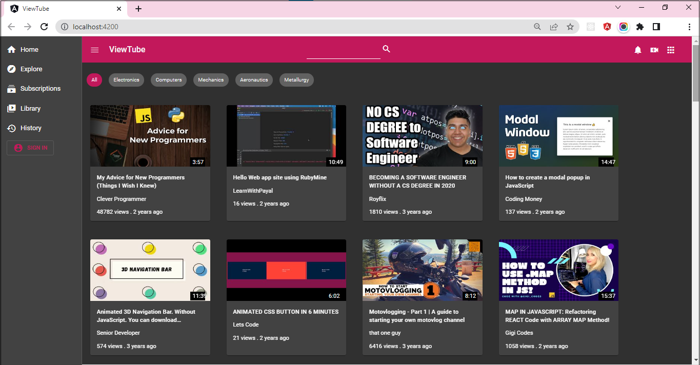

## Practice

This practice comprises 1 exercise.

### Context

OTT – Over-the-top media is no longer the future of entertainment but is now the reality.​

With over 50% of North Americans maintaining Netflix subscriptions, it is clear that consumers love OTT content. It is the most popular form of entertainment today across all age groups. All that a consumer needs to have is a compatible hardware device enabled with a good internet connection.​

An `over-the-top` media service is any online content provider that offers streaming media as a standalone product. An OTT conversation largely revolves around video-on-demand. However, it also supports audio, messaging, and VOIP.​

Any application or service that provides a product over the internet while bypassing traditional media services is an OTT application.​

Popular OTT applications for video streaming are Netflix, Amazon Video, YouTube, HBO, etc.

​### Problem Statement

Using Angular Material components and themes, transform the design of existing ViewTube application for a rich user experience. 

The scaffolding of this application is available with the boilerplate code.​

### Tasks

#### Task # 1 – Install Angular Material

- Use the boilerplate code provided for ViewTube application.
- Run the command `ng add @angular/material` to install Angular Material packages.
    - While the installation is in progress, respond to the prompts
      - When prompted for prebuilt-theme selection, use `pink-bluegrey.css` option.
      - Respond with input “Y”, when prompted for installing Angular Material typography styles
      - Allow animations to be included and enabled

#### Task # 2 – Add Navigation Schematics 

- To add Navigation Schematics run the command given below:
	`ng generate @angular/material:navigation navigation-bar`
- The command creates Angular component with the name `navigation-bar` and updates the import statements in `app.module.ts` file

#### Task # 3 – Configure Navigation-Bar Component

- The navigation schematic created a new component `Navigation-Bar`. 
- This component includes a toolbar with the page title `ViewTube`, and a responsive side nav based on Material breakpoints.
- In the provided boilerplate code, the `App` component contains the design code for page header and renders `Chips-Bar` component and `Video-Content` component.
- This responsibility should be now handled by the `Navigation-Bar` component.

##### Task # 3 – Steps

1. Copy the following code existing inside the template of `app component` code (in file `app.component.html`)
```html
    <div id="header">
        <div id="title-block">
            <a id="home-link" href="/">
            <h1>ViewTube</h1>
            </a>
        </div>
        <div id="search">
            <input type="text" name="searchquery" id="searchquery">
            <button>search</button>
        </div>
        <div id="navbar">
            <button>Notifications</button>
            <button>Video Call</button>
            <button>Apps</button>
        </div>
    </div>
```
2. The copied code should be pasted in the template of `Navigation-Bar` component (in `navigation-bar.component.html` file) in the `<mat-sidenav-content>` overwriting the `<span>` element
```html
    <mat-sidenav-content>
        <mat-toolbar color="primary">
            <button type="button" aria-label="Toggle sidenav" mat-icon-button (click)="drawer.toggle()">
                <mat-icon aria-label="Side nav toggle icon">menu</mat-icon>
            </button>
            <div id="header">
                <div id="title-block">
                    <a id="home-link" href="/">
                    <h1>ViewTube</h1>
                    </a>
                </div>
                <div id="search">
                    <input type="text" name="searchquery" id="searchquery">
                    <button>search</button>
                </div>
                <div id="navbar">
                    <button>Notifications</button>
                    <button>Video Call</button>
                    <button>Apps</button>
                </div>
            </div>
        </mat-toolbar>
        <!-- Add Content Here -->
    </mat-sidenav-content>
```
3. In the same file, update code to add the `Chips-Bar` and `Video-Content` component selectors below the comment `Add Content Here`:
```html
    <!-- Add Content Here -->
    <app-chips-bar></app-chips-bar>
    <app-video-content></app-video-content>
```
4. The attributes inside `<mat-sidenav>` needs to be modified to keep the side-bar always opened to the side.
```html
    <mat-sidenav #drawer class="sidenav" fixedInViewport 
        [attr.role]="'navigation'" [mode]="'side'" [opened]="true"> 
```
5. To generate links in the side-navbar, the link text in `<mat-nav-list>` should be updated as follows:
```html
    <mat-nav-list>
        <a mat-list-item href="/">
            <mat-icon class="icon">home</mat-icon> Home
        </a>
        <a mat-list-item href="#">
            <mat-icon class="icon">explore</mat-icon>Explore
        </a>
        <a mat-list-item href="#">
            <mat-icon class="icon">subscriptions</mat-icon>Subscriptions
        </a>
        <a mat-list-item href="#">
            <mat-icon class="icon">video_library</mat-icon>Library
        </a>
        <a mat-list-item href="#">
            <mat-icon class="icon">history</mat-icon>History
        </a>
        <a mat-list-item>
            <button mat-stroked-button id="signin-button" color="primary">
                    <mat-icon class="icon">account_circle</mat-icon>SIGN IN
            </button>
        </a>
    </mat-nav-list>
```
6. To keep the `menu` button always visible remove the `*ngIf` directive from the `menu` button
```html
    <button type="button" aria-label="Toggle sidenav" mat-icon-button (click)="drawer.toggle()">
        <mat-icon aria-label="Side nav toggle icon">menu</mat-icon>
    </button>
```
7. Style the `Navigation-Bar` component contents by adding the below CSS properties to the `navigation-bar.component.css` file:
```css
    #header{
        display: flex;
        justify-content: space-between;
        align-items: center;
        padding: 10px;
        width: 100%;
    }
    #title-block {
        display:flex;
        justify-content: left;
        align-items: center;
    }
    #search {
        width: 400px;
        font-size: 14px;
    }
```
8. To add spacing between `<mat-icon>` and the link text in `<side-nav>` add the following CSS code in `navigation-bar.component.css` file
```css
    .icon {
        margin-right: 10px;
    }
```

9. Replace the code inside the template of `App` component (in `app.component.html` file) with the `Navigation-Bar` component's selector:
```html
    <app-navigation-bar></app-navigation-bar>
```

10. Delete code from `.css` file of `App` component.

#### Task # 4 – Styling Search Box

- The input element that accepts search text and the search button can be styled using Angular Material Form-Field and Material Button components.
- Instead of button text, Angular Material Icon component can be used with search icon.
- To use these Material components:
    - Import `MatFormFieldModule` and `MatInputModule` in `angular.module.ts` file.
    - The modules must be added in the `import` list in `@NgModule`.

##### Task # 4 – Steps

1. Replace the contents inside the `<div>` element with id `search` in `navigation-bar.component.html` file as shown below to use `<mat-form-field>`, `mat-icon-button` and `mat-icon` Angular Material components
```html
    <div id="search">
        <mat-form-field>
            <input matInput type="text" name="searchquery" id="searchquery">
            <button mat-icon-button>
            <mat-icon class="icon">search</mat-icon>
            </button>
        </mat-form-field>
    </div>
```

#### Task # 5 – Styling Navigation Buttons

- The navigation buttons in the navigation bar of the toolbar can be styled with Angular Material Button and Icon components.

##### Task # 5 – Steps

1. Replace the contents inside the `<div>` element with id `navbar` in `navigation-bar.component.html` file as shown below to use Angular Material components:
```html
    <div id="navbar">
        <button mat-icon-button matTooltip="Notifications">
            <mat-icon class="icon">notifications</mat-icon>
        </button>
        <button mat-icon-button matTooltip="Create Video">
            <mat-icon class="icon">video_call</mat-icon>
        </button>
        <button mat-icon-button matTooltip="Apps">
            <mat-icon class="icon">apps</mat-icon>
        </button>
    </div>
```
2. Style the heading `ViewTube` in `NavigationBar` component to remove the text-decoration and change the font color with the following code in `navigation-bar.component.css` file:
```css
    #home-link {
        text-decoration: none;
        color: whitesmoke;
    }  
```

#### Task # 6 – Styling Chips-Bar Component

- The chips in `Chips-Bar` component are designed as unordered list.
- The unordered list can be replaced with Angular Material `Chips` component.
- To use this Material component:
    - Import `MatChipsModule` in `angular.module.ts` file.
    - The modules must be added in the `import` list in `@NgModule`.

##### Task # 6 – Steps

1. Replace the contents in `chips-bar.component.html` with Angular Material `Chips` component
```html
    <mat-chip-list id="chips">
        <mat-chip class="chip" color="primary" selected>All</mat-chip>
        <mat-chip class="chip" color="primary">Electronics</mat-chip>
        <mat-chip class="chip" color="primary">Computers</mat-chip>
        <mat-chip class="chip" color="primary">Mechanics</mat-chip>
        <mat-chip class="chip" color="primary">Aeronautics</mat-chip>
        <mat-chip class="chip" color="primary">Metallurgy</mat-chip>
    </mat-chip-list>
```
2. Style the chips by replacing the code in `chips-bar.component.css` file with the code given below:
```css
    .chip {
        margin: 30px 1px 30px 15px !important;
        font-size: small;
        font-weight: 300;
    }
```

#### Task # 7 – Styling Video-Content Component

- In the given boilerplate code, the video content is presented by the `Video-Content` component using HTML5 elements and CSS3 style properties.
- The content can be styled using Angular Material Card component where each Card component presents a particular video content.
- Additionally, ripple effect can be added to the card using Angular Material Ripple attribute directive.
- To use these Angular Material component and directive
    - Import `MatCardModule` and `MatRippleModule` in `angular.module.ts` file.
    - The modules must be added in the `import` list in `@NgModule`.

##### Task # 7 – Steps

1. Replace the template code in `video-content.component.html` file with below code:
```html
    <mat-card matRipple class="card" *ngFor="let video of video$ ">
        <a href="#">
            
        </a>
        <div id="duration">{{ video.contentDetails.length }}</div>
        <mat-card-content>
            <h5>{{ video.snippet.title }}</h5>
            <p>{{ video.snippet.channelTitle }}</p>
            <p>{{ video.statistics.viewCount }} views . {{ video.snippet.relativeTime }}</p>
        </mat-card-content>
    </mat-card>
```

2. Replace the CSS code in `video-content.component.css` file with code given on slide
```css
    .card {
        width: 260px;
        height: 250px;
        display: inline-block;
        margin: 20px;            
    }
    .card img{
        height: 150px;
    }
    .card h5{
        white-space: normal;
        overflow: hidden;
        text-overflow: ellipsis;
        letter-spacing: .25px;
        font-weight: 500;
        font-size: 1em;
        -webkit-line-clamp: 2;
        -webkit-box-orient: vertical;
        display: -webkit-box;
    }
    #duration {
        background-color: black;
        color: whitesmoke;
        position: absolute;
        top: 45%;
        right: 4%;
        z-index: 1;
        width: 25px;
        height: 20px;
        text-align: right;
        padding: 1px 6px;
    }
``` 
#### Expected Output

**The image for the expected output is displayed below**

